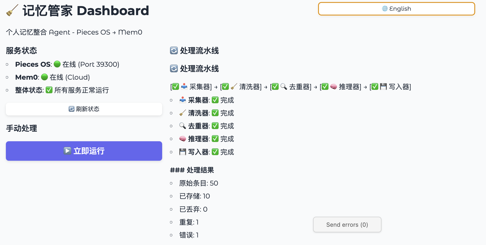
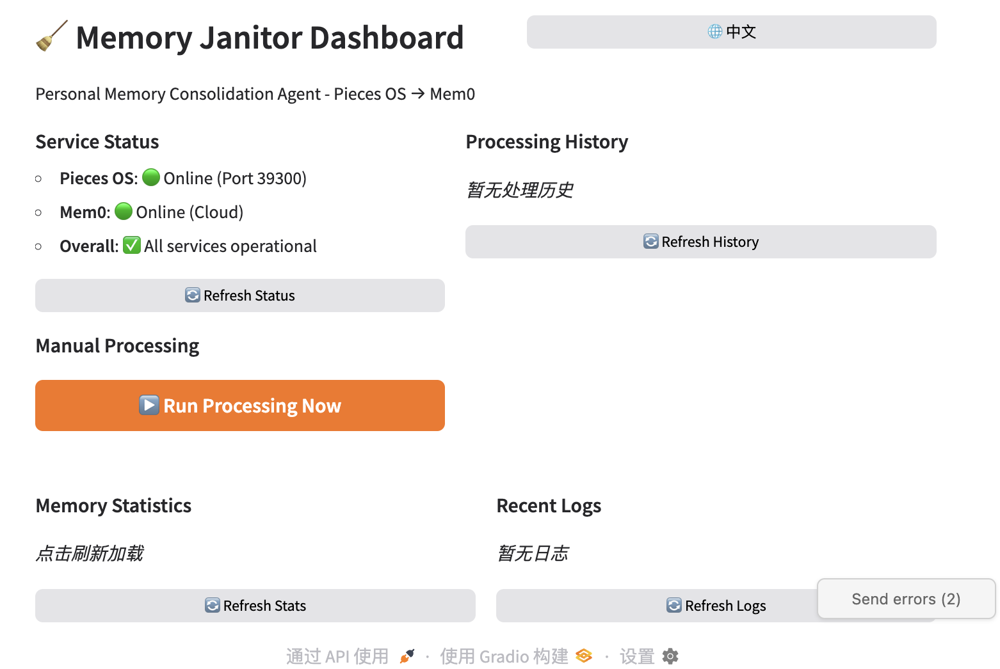

#  Pieces-to-Mem0


[简体中文](./README.md) | English

---

> [!IMPORTANT]
> **Prerequisite**: This tool requires [Pieces OS](https://pieces.app/) running locally (default port 39300).

## Overview

**A personal memory consolidation Agent built on LangGraph workflow to solve the "memory silo" problem in AI coding assistants. Through an LLM-driven five-stage pipeline (Collect → Denoise → Deduplicate → Classify → Store), it distills Pieces OS screen activity data into structured semantic memories, persisting to Mem0 for cross-tool long-term memory sharing.**

---

## Demo

<table align="center">
  <tr>
    <td align="center"><b>🇨🇳 Chinese UI</b><br></td>
    <td align="center"><b>🇬🇧 English UI</b><br></td>
  </tr>
</table>

---

## Features

| Feature | Description |
|---------|-------------|
| 🔄 **Auto Collection** | Fetch screen activities, OCR text, workflow summaries from Pieces OS |
| 🧹 **Smart Denoising** | LLM-driven filtering of ads, chats, and low-value content |
| 🔍 **Semantic Dedup** | Call Mem0 search() to avoid duplicate storage |
| 🏷️ **Priority Classification** | Auto-identify core decisions, tech discoveries, user preferences, milestones |
| 💾 **Persistent Storage** | Write to Mem0 for Claude Code / Cursor access |
| 📊 **Visual Monitoring** | Gradio Dashboard with bilingual support |
| ⏰ **Scheduled Execution** | APScheduler background automation |

---

## Architecture

```
┌─────────────────────────────────────────────────────────────┐
│                    Presentation Layer                        │
│  Gradio Dashboard │ CLI Commands │ Webhook (Reserved)        │
└─────────────────────────────────────────────────────────────┘
                                │
┌─────────────────────────────────────────────────────────────┐
│                 Business Layer (LangGraph Workflow)          │
│  Collector → Cleaner → Deduplicator → Reasoner → Writer      │
└─────────────────────────────────────────────────────────────┘
                                │
┌─────────────────────────────────────────────────────────────┐
│                    Integration Layer                         │
│  Pieces Client │ LLM (Gemini/Claude) │ Mem0 Client           │
└─────────────────────────────────────────────────────────────┘
```

**5 Processing Nodes**:
| Node | Function |
|------|----------|
| **Collector** | Fetch incremental activity data from Pieces OS API |
| **Cleaner** | LLM-driven denoising, filter low-value content |
| **Deduplicator** | Semantic dedup to avoid duplicate storage |
| **Reasoner** | Classify priority, extract atomic facts |
| **Writer** | Write to Mem0 with rich metadata |

---

## Installation

### 1. Clone Repository

```bash
git clone https://github.com/mango766/pieces-to-mem0.git
cd pieces-to-mem0
```

### 2. Install Dependencies

```bash
pip install -e .
```

### 3. Configure Environment Variables

```bash
cp .env.example .env
```

Edit `.env` file with your API keys:

```bash
# Mem0 API Key (Required)
MEM0_API_KEY=your_mem0_api_key

# LLM Provider (Choose one)
GOOGLE_API_KEY=your_gemini_api_key
# or
ANTHROPIC_API_KEY=your_claude_api_key
```

### 4. Verify Installation

```bash
memory-janitor status
```

Expected output:
- 🟢 Pieces OS: Online (Port 39300)
- 🟢 Mem0: Online (Cloud)
- ✅ Overall: All services operational

---

## Usage

### CLI Commands

```bash
# Run processing once
memory-janitor run

# Run as background daemon
memory-janitor daemon

# Launch Gradio monitoring dashboard
memory-janitor dashboard

# Check service status
memory-janitor status
```

### Quick Start

```bash
./run.sh
```

---

## Configuration

Configuration file located at `config/settings.yaml`:

### `app` - Application Settings
- **`name`**
  - **Default**: `memory-janitor`
  - **Description**: Application name
- **`version`**
  - **Default**: `0.1.0`
  - **Description**: Application version
- **`debug`**
  - **Default**: `false`
  - **Description**: Enable debug mode
  - **Options**: `true` / `false`

### `pieces` - Pieces OS Settings
- **`host`**
  - **Default**: `localhost`
  - **Description**: Pieces OS host address
- **`port`**
  - **Default**: `39300`
  - **Description**: Pieces OS port
- **`timeout`**
  - **Default**: `30`
  - **Description**: API request timeout (seconds)
- **`checkpoint_file`**
  - **Default**: `.pieces_checkpoint.json`
  - **Description**: Incremental sync checkpoint file path

### `mem0` - Mem0 Settings
- **`mode`**
  - **Default**: `cloud`
  - **Description**: Mem0 operation mode
  - **Options**: `cloud` / `local`
- **`api_base`**
  - **Default**: `https://api.mem0.ai`
  - **Description**: Mem0 API address (modify for local mode)
- **`user_id`**
  - **Default**: `default_user`
  - **Description**: Mem0 user identifier

### `llm` - LLM Settings
- **`provider`**
  - **Default**: `gemini`
  - **Description**: LLM provider
  - **Options**: `gemini` / `anthropic`
- **`model`**
  - **Default**: `gemini-2.0-flash-exp`
  - **Description**: Model name
- **`temperature`**
  - **Default**: `0.3`
  - **Description**: Generation temperature (0-1)
- **`max_tokens`**
  - **Default**: `4096`
  - **Description**: Maximum output tokens

### `scheduler` - Scheduler Settings
- **`enabled`**
  - **Default**: `true`
  - **Description**: Enable scheduled tasks
  - **Options**: `true` / `false`
- **`interval_minutes`**
  - **Default**: `30`
  - **Description**: Execution interval (minutes)
- **`timezone`**
  - **Default**: `Asia/Shanghai`
  - **Description**: Timezone setting

### `pipeline` - Pipeline Settings
- **`batch_size`**
  - **Default**: `50`
  - **Description**: Number of activities per batch
- **`dedup_threshold`**
  - **Default**: `0.85`
  - **Description**: Deduplication similarity threshold (0-1)
- **`cleaner_prompt`**
  - **Default**: `prompts/cleaner.txt`
  - **Description**: Cleaner prompt file path
- **`reasoner_prompt`**
  - **Default**: `prompts/reasoner.txt`
  - **Description**: Reasoner prompt file path

### `dashboard` - Dashboard Settings
- **`host`**
  - **Default**: `127.0.0.1`
  - **Description**: Dashboard listen address
- **`port`**
  - **Default**: `7860`
  - **Description**: Dashboard port
- **`share`**
  - **Default**: `false`
  - **Description**: Generate public share link
  - **Options**: `true` / `false`

### `logging` - Logging Settings
- **`level`**
  - **Default**: `INFO`
  - **Description**: Log level
  - **Options**: `DEBUG` / `INFO` / `WARNING` / `ERROR`
- **`format`**
  - **Default**: `json`
  - **Description**: Log format
  - **Options**: `json` / `console`
- **`file`**
  - **Default**: `logs/memory-janitor.log`
  - **Description**: Log file path
- **`rotation`**
  - **Default**: `10MB`
  - **Description**: Log rotation size

---

## Priority Classification

The system automatically classifies memories into 5 priority categories:

| Category | Identifier | Description |
|----------|------------|-------------|
| 🔴 Core Decision | `core_decision` | Architecture decisions, tech choices, important conclusions |
| 🟠 Tech Discovery | `tech_discovery` | Newly learned technical knowledge, solutions |
| 🟡 User Preference | `user_preference` | Personal habits, tool preferences, workflows |
| 🟢 Project Milestone | `project_milestone` | Feature completion, releases, major progress |
| ⚪ General Info | `general_info` | Other valuable but non-critical information |

---

## Troubleshooting

### Before Submitting an Issue

1. **Export logs**:
   ```bash
   cat logs/memory-janitor.log | tail -100
   ```

2. **Check service status**:
   ```bash
   memory-janitor status
   ```

3. **Screenshot the Dashboard status panel**

### Common Issues

| Issue | Solution |
|-------|----------|
| 🔴 Pieces OS Offline | Ensure Pieces app is running, check port 39300 |
| 🔴 Mem0 Connection Failed | Verify `MEM0_API_KEY` is correctly configured |
| 🔴 LLM Call Failed | Check `GOOGLE_API_KEY` or `ANTHROPIC_API_KEY` |
| 🟡 Slow Processing | Adjust `pipeline.batch_size` or upgrade LLM model |

---

## Development

```bash
# Install dev dependencies
pip install -e ".[dev]"

# Run tests
pytest

# Format code
ruff format .

# Type checking
mypy src/
```

---

## License

MIT License

---

## Acknowledgments

- [Pieces](https://pieces.app/) - Intelligent code snippet management
- [Mem0](https://mem0.ai/) - AI memory layer
- [LangGraph](https://github.com/langchain-ai/langgraph) - Workflow orchestration
- [Gradio](https://gradio.app/) - Rapid UI building
